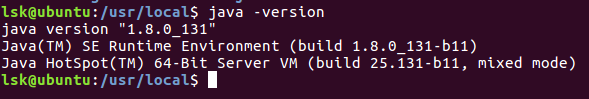

# Ubuntu下安装jdk


https://www.cnblogs.com/ericli-ericli/p/7070874.html

* **步骤1**：下载jdk
    * 我选择的jdk版本文件: jdk-8u131-linux-x64.tar.gz


* **步骤2**：创建单独的目录

    * sudo mkdir /opt/java/jdk1.8

* **步骤3**：将下载的文件复制到我们创建的文件夹下

    * sudo cp /home/hyc/Downloads/jdk-8u131-linux-x64.tar.gz /opt/java/jdk1.8 (注意lsk是我的用户名，jdk版本也注意)

* **步骤4**：解压缩文件

    * sudo tar -zxvf jdk-8u131-linux-x64.tar.gz

* **步骤5**：配置环境变量
    * sudo gedit /etc/environment
    ``` shell
    PATH="/usr/local/sbin:/usr/local/bin:/usr/sbin:/usr/bin:/sbin:/bin:/usr/games:/usr/local/games:$JAVA_HOME/bin"
    export CLASSPATH=.:$JAVA_HOME/lib:$JAVA_HOME/jre/lib
    export JAVA_HOME=/opt/java/jdk1.8
    ```
    * 注意JAVA_HOME是JDK的目录，也就是那个我们新建的路径。
    * 保存并关闭后，使用命令 source /etc/environment 使环境变量立刻生效。

* **步骤6**：配置所有用户的环境变量

    * 为了预防重启后，配置的环境变量无效，配置所有用户的环境变量
    * sudo gedit /etc/profile
    * 在文件的最后添加以下内容：
    ``` shell
    # set Java environment
    export JAVA_HOME=/opt/java/jdk1.8
    export JRE_HOME=$JAVA_HOME/jre
    export CLASSPATH=.:$JAVA_HOME/lib:$JRE_HOME/lib:$CLASSPATH
    export PATH=$JAVA_HOME/bin:$JRE_HOME/bin:$PATH
    ```
    * 执行 source /etc/profile 是全局设置立刻生效

* **步骤7**：重启检验

    * 执行命令 sudo shutdown -r now 后，输入密码重启，Ctrl+Alt+t打开命令框，输入 java -version看结果：

      
