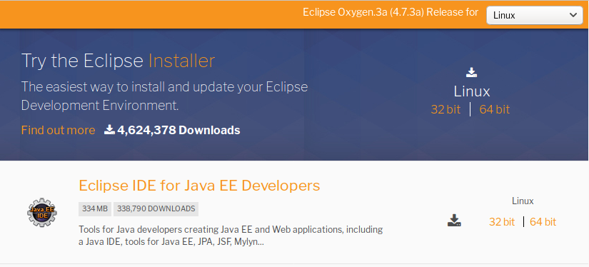

# Ubuntu18.04 安装Eclipse Oxygen


https://blog.csdn.net/weixx3/article/details/80350087

Ubuntu 安装Eclipse Oxygen

1. 去官网下载,链接点此。




2. 移动到自己指定的位置

   ```shell
   sudo mv eclipse-jee-oxygen-3a-linux-gtk-x86_64.tar.gz /opt
   ```


3. 解压

   ``` shell
   sudo tar -zxvf eclipse-jee-oxygen-3a-linux-gtk-x86_64.tar.gz  
   sudo rm -rf eclipse-jee-oxygen-3a-linux-gtk-x86_64.tar.gz 
   ```

   解压之后的文件夹名字就为：eclipse 

 

4. 创建eclipse桌面快捷图标

   ``` shell
   cd /usr/share/applications
   sudo vi eclipse.desktop
   ```

   最后将下面的代码复制到文件中(注意不要有多余的空格)：

   ``` shell
   [Desktop Entry]
   Encoding=UTF-8
   Name=Eclipse
   Comment=Eclipse
   Exec=/opt/eclipse/eclipse
   Icon=/opt/eclipse/icon.xpm
   Terminal=false
   StartupNotify=true
   Type=Application
   Categories=Application;Development;
   ```

   其中“Exec=”后面为eclipse安装目录下的eclipse程序的位置路径，“Icon=”后面为eclipse安装目录下的图标图片的路径

   再修改下eclipse.desktop的权限

   ``` shell
   sudo chmod u+x eclipse.desktop
   ```


5. 会遇到的报错

   ``` shell
   No Java Virtual machine was found after searching the following locations：… 
   ```

   解决方法： 

   cd到eclipse的安装目录下，建立软连接，连接到 jre， 

   ln -s /此处为jdk的安装目录/jre jre 即可

   ``` shell
   sudo ln -s /opt/java/jdk1.8/jre/ jre
   ```


6. 打开eclipse