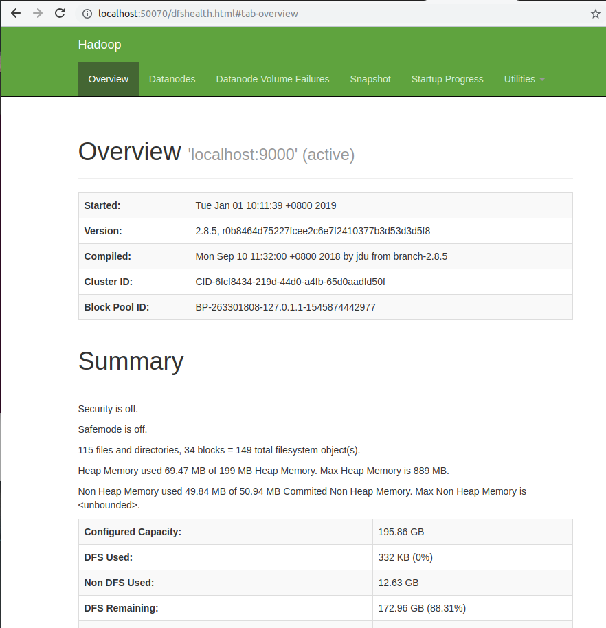

## Ubuntu18.04搭建Hadoop3.0.3


https://blog.csdn.net/Zheng_junming/article/details/82926932

同样适用于hadoop2.8.5


1. 创建hadoop用户(可以不创建，直接使用当前用户，直接到第二步) 

   首先确保在`root`账号下，创建一个`hadoop`用户 

   ``` shell
   sudo useradd -m hadoop -s /bin/bash
   ```

   设置密码

   ```shell
   sudo passwd hadoop
   ```

   增加管理员权限

   ```shell
   sudo adduser hadoop sudo
   ```

   使用`su hadoop`即可进行切换

 

2. 安装SSH

   ``` shell
   sudo apt install openssh-server
   ```

   安装后即可使用`ssh localhost`进行登录，首次登录需要密码，输入刚刚设置的密码即可设置免密码登录

   先退出刚刚的登录：`exit`

   切换到`ssh`目录：`cd ~/.ssh/`

   输入以下命令。然后一路回车

   ```shell
   ssh-keygen -t rsa
   ```

   进行授权

   ``` shell
   cat ./id_rsa.pub >> ./authorized_keys
   ```

   配置完即可使用ssh localhost进行免密登录

 

3. 安装Java

   省略


4. 安装Hadoop

   下载Hadoop，可以点击此链接进行下载hadoop-3.0.3.tar.gz

   下载完安装到`/opt`

   ``` shell
   sudo tar -zxf ~/Downloads/hadoop-3.0.3.tar.gz -C /opt
   cd / opt
   sudo mv ./hadoop-3.0.3/ ./hadoop  
   sudo chown -R hadoop ./hadoop
   ```

   可以使用以下命令查看是否安装成功

   ``` shell
   cd /opt/hadoop
   ./bin/hadoop version
   ```


* 单机模式配置

  先把java的路径配置到hadoop上

  ``` shell
  sudo vi ./etc/hadoop/hadoop-env.sh
  ```

  插入`export JAVA_HOME=/opt/java/jdk1.8`，路径可变

  解压后默认就是单机的配置，可以运行以下的例子

  ``` shel
  cd /opt /hadoop
  mkdir ./input
  cp ./etc/hadoop/*.xml ./input
  ./bin/hadoop jar ./share/hadoop/mapreduce/hadoop-mapreduce-examples-3.0.3.jar grep ./input/ ./output 'dfs[a-z.]+'
  cat ./output/*
  ```

  如果没有报错的话最后的输出如下

  ``` shell
  1      dfsadmin
  ```

  注意，Hadoop默认不会覆盖结果文件，因此再次运行上面实例会提示出错，需要先将./output删除。

 

* 伪分布式配置

  修改配置文件`core-site.xml`

  ``` shell
  sudo vi ./etc/hadoop/core-site.xml
  ```

  修改为

  ``` xml
  <configuration>
      <property>
          <name>hadoop.tmp.dir</name>
          <value>/opt/hadoop/tmp</value>
          <description>Abase for other temporary directories.</description>
      </property>
      <property>
          <name>fs.defaultFS</name>
          <value>hdfs://localhost:9000</value>
      </property>
  </configuration>        
  ```

  修改配置文件`hdfs-site.xml`

  ``` she
  sudo vi ./etc/hadoop/hdfs-site.xml
  ```

  修改为

  ``` xml
  <configuration>
      <property>
          <name>dfs.replication</name>
          <value>1</value>
      </property>
      <property>
          <name>dfs.namenode.name.dir</name>
          <value>/opt/hadoop/tmp/dfs/name</value>
      </property>
      <property>
          <name>dfs.datanode.data.dir</name>
          <value>/opt/hadoop/tmp/dfs/data</value>
      </property>
  </configuration>  
  ```

  配置完成后，执行NameNode的格式化

  ``` shell
  ./bin/hdfs namenode -format
  ```

  此命令只需要执行一次

   接着启动hdfs

  ``` shell
  ./sbin/start-dfs.sh
  ```

  如果出现以下警告

  ``` shell
  WARN util.NativeCodeLoader: Unable to load native-hadoop library for your platform... using builtin-java classes where applicable
  ```

   则需要修改`hadoop-env.sh`文件

  ``` shell
  sudo vi ./etc/hadoop/hadoop-env.sh
  ```

  然后插入以下内容

  ``` shell
  export HADOOP_OPTS="-Djava.library.path=${HADOOP_HOME}/lib/native"
  ```

  启动后我们可以运行jps命令查看端口信息

  ``` shell
  31253 SecondaryNameNode
  30789 NameNode
  31382 Jps
  30974 DataNode
  ```

* 访问http://localhost:50070

  

  证明运行成功


  * 运行Hadoop伪分布式实例

  ``` shell
  ./bin/hdfs dfs -mkdir -p /user/hadoop
  ./bin/hdfs dfs -mkdir input
  ./bin/hdfs dfs -put ./etc/hadoop/*.xml input
  ./bin/hdfs dfs -ls input
  ```

  最后可以看到input文件夹里面的文件

   

  运行实例

  ``` shell
  ./bin/hadoop jar ./share/hadoop/mapreduce/hadoop-mapreduce-examples-3.0.3.jar grep input output 'dfs[a-z.]+'
  ```

  如果一切正常运行，结束后执行命令

  ``` shell
  ./bin/hdfs dfs -cat output/*
  ```

  将得到以下内容

  ``` shell
  1     dfsadmin
  1     dfs.replication
  1     dfs.namenode.name.dir
  1     dfs.datanode.data.dir
  ```

  若出现以下报错，则需要修改权限

  ``` shell
  Permission denied: user=root, access=WRITE,inode="/user":hadoop:supergroup:drwxr-xr-x
  ```

  解决方法（需要配置Hadoop的环境变量）

  ``` shell
  hadoop fs -ls
  hadoop fs -chmod 777 /user
  ```

  若还出现以下错误

  ``` shell
  Permission denied: user=root, access=WRITE, inode="/user/hadoop":hadoop:supergroup:drwxr-xr-x
  ```

  这个错误说明了我们不能写文件进入hdfs，所以需要修改`hdfs-site.xml`

  增加以下的内容

  ``` shell
  <property>
      <name>dfs.permissions</name>
      <value>false</value>
  </property>
  ```

  然后重启hdfs，再次运行实例如果遇到以下错误

  ``` shell
  Name node is in safe mode
  ```

  在分布式文件系统启动的时候，开始的时候会有安全模式，当分布式文件系统处于安全模式的情况下，文件系统中的内容不允许修改也不允许删除，直到安全模式结束。安全模式主要是为了系统启动的时候检查各个DataNode上数据块的有效性，同时根据策略必要的复制或者删除部分数据块。运行期通过命令也可以进入安全模式。

  所以只需要停掉安全模式即可，运行以下命令

  ``` shell
  ./bin/hadoop dfsadmin -safemode leave
  ```

  用户可以通过dfsadmin -safemode value 来操作安全模式，value的值如下

  * enter - 进入安全模式
  * leave - 强制NameNode离开安全模式
  * get - 返回安全模式是否开启的信息
  * wait - 等待，一直到安全模式结束