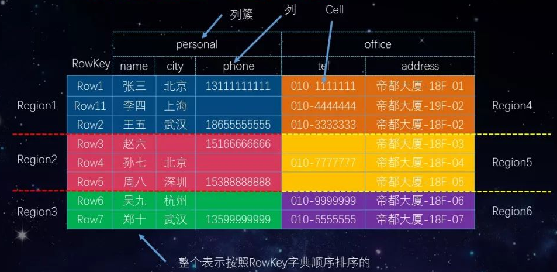

## hadoop生态圈各个组件简介

作者：AA赵师傅 
原文：https://blog.csdn.net/zcb_data/article/details/80402411 

Hadoop 是一个能够对大量数据进行分布式处理的软件框架。具有可靠、高效、可伸缩的特点。Hadoop 的核心是 HDFS 和 Mapreduce，HDFS 还包括 YARN。

1. **HDFS（hadoop分布式文件系统）**

   是hadoop体系中数据存储管理的基础。他是一个高度容错的系统，能检测和应对硬件故障。

   client：切分文件，访问HDFS，与那么弄得交互，获取文件位置信息，与DataNode交互，读取和写入数据。

   namenode：master节点，在hadoop1.x中只有一个，管理HDFS的名称空间和数据块映射信息，配置副本策略，处理客户 端请求。

   DataNode：slave节点，存储实际的数据，汇报存储信息给namenode。

   secondary namenode：辅助namenode，分担其工作量：定期合并fsimage和fsedits，推送给namenode；紧急情况下和辅助恢复namenode，但其并非namenode的热备。

2. **mapreduce（分布式计算框架）**

   mapreduce是一种计算模型，用于处理大数据量的计算。其中map对应数据集上的独立元素进行指定的操作，生成键-值对形式中间，reduce则对中间结果中相同的键的所有值进行规约，以得到最终结果。

   jobtracker：master节点，只有一个，管理所有作业，任务/作业的监控，错误处理等，将任务分解成一系列任务，并分派给tasktracker。

   tacktracker：slave节点，运行 map task和reducetask；并与jobtracker交互，汇报任务状态。

   map task：解析每条数据记录，传递给用户编写的map（）并执行，将输出结果写入到本地磁盘（如果为map—only作业，则直接写入HDFS）。

   reduce task：从map 它深刻地执行结果中，远程读取输入数据，对数据进行排序，将数据分组传递给用户编写的reduce函数执行。

3. **hive（基于hadoop的数据仓库）**

   由Facebook开源，最初用于解决海量结构化的日志数据统计问题。

   hive定于了一种类似sql的查询语言（hql）将sql转化为mapreduce任务在hadoop上执行。

4. **hbase（分布式列存数据库）**

   hbase是一个针对结构化数据的可伸缩，高可靠，高性能，分布式和面向列的动态模式数据库。和传统关系型数据库不同，hbase采用了bigtable的数据模型：增强了稀疏排序映射表（key/value）。其中，键由行关键字，列关键字和时间戳构成，hbase提供了对大规模数据的随机，实时读写访问，同时，hbase中保存的数据可以使用mapreduce来处理，它将数据存储和并行计算完美结合在一起。

   高可靠、高性能、面向列、可伸缩、实时读写的**分布式数据库**

   利用HDFS作为其文件存储系统，支持MR程序读取数据

   存储非结构化和半结构化的数据

   

   RowKey: 数据唯一标识，按字典排序

   Columun Family: 列族，多个列的集合，最好不要超过3个

   TimeStamp时间戳: 支持多版本数据同时存在

   Version Number: 类型为Long，默认值是系统时间戳，可由用户自定义

   Value: 真实的数据

   Region: 段数据的集合

   RegionServer: 用于存放Region的服务

   参考: http://www.cnblogs.com/dadadechengzi/p/9866925.html

5. **zookeeper（分布式协作服务）**

   解决分布式环境下的数据管理问题：统一命名，状态同步，集群管理，配置同步等。

   Hadoop有NameNode，HBase有HMaster，为什么还需要zookeeper，下面给大家通过例子给大家介绍。
   一个Zookeeper的集群中,3个Zookeeper节点.一个leader,两个follower的情况下,停掉leader,然后两个follower选举出一个leader.获取的数据不变.我想Zookeeper能够帮助Hadoop做到:

   ​	Hadoop,使用Zookeeper的事件处理确保整个集群只有一个NameNode,存储配置信息等.
   ​	HBase,使用Zookeeper的事件处理确保整个集群只有一个HMaster,察觉HRegionServer联机和宕机,存储访问控制列表等.

   参考: http://developer.51cto.com/art/201809/583184.htm

   参考: https://blog.csdn.net/weijifeng_/article/details/79775738

6. **sqoop（数据同步工具）**

   sqoop是sql-to-hadoop的缩写，主要用于传统数据库和hadoop之间传输数据。

   数据的导入和导出本质上是mapreduce程序，充分利用了MR的并行化和容错性。

7. **pig（基于hadoop的数据流系统）**

   定义了一种数据流语言-pig latin，将脚本转换为mapreduce任务在hadoop上执行。

   通常用于离线分析。

8. **mahout（数据挖掘算法库）**

   mahout的主要目标是创建一些可扩展的机器学习领域经典算法的实现，旨在帮助开发人员更加方便快捷地创建只能应用程序。mahout现在已经包含了聚类，分类，推荐引擎（协同过滤）和频繁集挖掘等广泛使用的数据挖掘方法。除了算法是，mahout还包含了数据的输入/输出工具，与其他存储系统（如数据库，mongoDB或Cassandra）集成等数据挖掘支持架构。

9. **flume（日志收集工具）**

   cloudera开源的日志收集系统，具有分布式，高可靠，高容错，易于定制和扩展的特点。他将数据从产生，传输，处理并写入目标的路径的过程抽象为数据流，在具体的数据流中，数据源支持在flume中定制数据发送方，从而支持收集各种不同协议数据。

10. **资源管理器的简单介绍（YARN和mesos）**

    随着互联网的高速发展，基于数据 密集型应用 的计算框架不断出现，从支持离线处理的mapreduce，到支持在线处理的storm，从迭代式计算框架到 流式处理框架s4，...，在大部分互联网公司中，这几种框架可能都会采用，比如对于搜索引擎公司，可能的技术方法如下：网页建索引采用mapreduce框架，自然语言处理/数据挖掘采用spark，对性能要求到的数据挖掘算法用mpi等。公司一般将所有的这些框架部署到一个公共的集群中，让它们共享集群的资源，并对资源进行统一使用，这样便诞生了资源统一管理与调度平台，典型的代表是mesos和yarn。

11. **其他的一些开源组件**：

    1. **cloudrea impala：**

        一个开源的查询引擎。与hive相同的元数据，SQL语法，ODBC驱动程序和用户接口，可以直接在HDFS上提供快速，交互式SQL查询。impala不再使用缓慢的hive+mapreduce批处理，而是通过与商用并行关系数据库中类似的分布式查询引擎。可以直接从HDFS或者Hbase中用select，join和统计函数查询数据，从而大大降低延迟。

    2. **spark：**

       spark是个开源的数据 分析集群计算框架，最初由加州大学伯克利分校AMPLab，建立于HDFS之上。spark与hadoop一样，用于构建大规模，延迟低的数据分析应用。spark采用Scala语言实现，使用Scala作为应用框架。

       spark采用基于内存的分布式数据集，优化了迭代式的工作负载以及交互式查询。

       与hadoop不同的是，spark与Scala紧密集成，Scala象管理本地collective对象那样管理分布式数据集。spark支持分布式数据集上的迭代式任务，实际上可以在hadoop文件系统上与hadoop一起运行（通过YARN,MESOS等实现）。

    3. **storm：**

       storm是一个分布式的，容错的计算系统，storm属于流处理平台，多用于实时计算并更新数据库。storm也可被用于“连续计算”，对数据流做连续查询，在计算时将结果一流的形式输出给用户。他还可被用于“分布式RPC”,以并行的方式运行昂贵的运算。

    4. **kafka：**

       kafka是由Apache软件基金会开发的一个开源流处理平台，由Scala和Java编写。Kafka是一种高吞吐量的分布式发布订阅消息系统，它可以处理消费者规模的网站中的所有动作流数据。 这种动作（网页浏览，搜索和其他用户的行动）是在现代网络上的许多社会功能的一个关键因素。 这些数据通常是由于吞吐量的要求而通过处理日志和日志聚合来解决。 对于像Hadoop的一样的日志数据和离线分析系统，但又要求实时处理的限制，这是一个可行的解决方案。Kafka的目的是通过Hadoop的并行加载机制来统一线上和离线的消息处理，也是为了通过集群来提供实时的消息

    5. **redis：**

       Redis是一个开源的使用ANSI C语言编写、支持网络、可基于内存亦可持久化的日志型、Key-Value数据库，并提供多种语言的API。

     

    **小结**

    为了方便理解以下按照功能进行了分类，并且把较为流行的排在了前面介绍，列表如下：

    参考: https://blog.csdn.net/cpaqyx/article/details/73694976

    * **文件系统**

      HDFS,目前大量采用的分布式文件系统，是整个大数据应用场景的基础通用文件存储组件。

      S3, Simple Storage Service简单存储服务，更好的可扩展性，内置的持久性，以及较低的价格

    * **资源调度**

      YARN,分布式资源调度，可以接收计算的任务把它分配到集群各节点处理，相当于大数据操作系统，通用性好，生态支持好

      Mesos，同YARN类似，偏向于资源的抽象和管理

    * **计算框架**

      Spark序列，有流计算、图计算、机器学习

      Flink，支持计算数据不断变化，即增量计算

      Storm，专注于流式计算，功能强大

      Mapreduce, 分布式计算基本计算框架，编程难度高，执行效率低

    * **数据库**

      Hbase，一种NoSQL列簇数据库，支持数十亿行数百万列大型数据储存和访问，尤其是写数据的性能非常好，数据读取实时性较好，提供一套API，不支持SQL操作，数据存储采用HDFS

      Cassandra，对大型表格和 Dynamo支持得最好

      Redis，运行异常快，还可应用于分布式缓存场景

    * **SQL支持**

      Spark SQL，由Shark、Hive发展而来的，以SQL方式访问数据源（如hdfs、hbase、S3、redis甚至关系统数据库等，下同）

      Phoenix，一套专注于SQL方式访问hbase的JDBC驱动，支持绝大部分SQL语法，支持二级索引，支持事务，低延时

      Hive，通过HQL（类似SQL）来统计分析生成查询结果，通过解析HQL生成可以Mapreduce上执行的任务，典型的应用场景是与hbase集成

      其它：impala、pig等，都实现了类似的功能，解决了直接写map/reduce分析数据的复杂性，降低了数据分析工作者或开发人员使用大数据的门槛

    * **其它工具**

      分布式协作zookeeper,可以理解为一个小型高性能的数据库，为生态圈中与很多组件提供发布订阅的功能，还可以监测节点是否失效（心跳检测），如HBase、Kafka中利用zookeeper存放了主从节点信息

      Kafka, 是一种分布式的，基于发布/订阅的消息系统,类似于消息对列的功能，可以接收生产者（如webservice、文件、hdfs、hbase等）的数据，本身可以缓存起来，然后可以发送给消费者（同上），起到缓冲和适配的作

      Flume,分布式的海量日志采集、聚合和传输的系统，主要作用是数据的收集和传输，也支持非常多的输入输出数据源

​	

