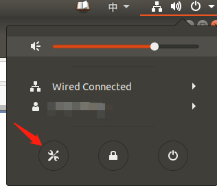
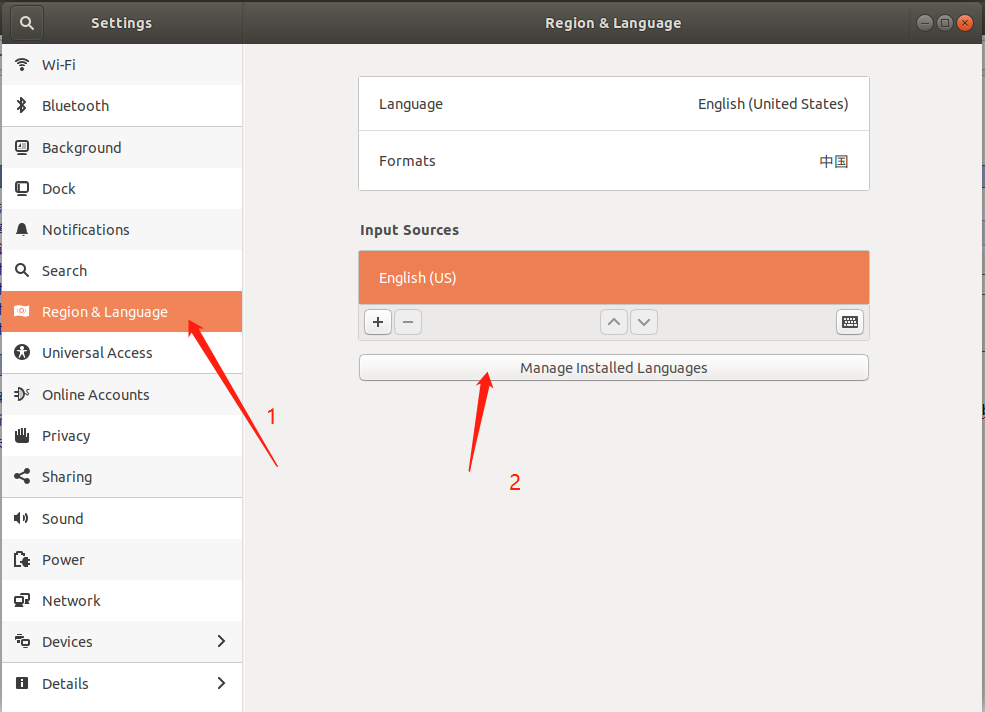
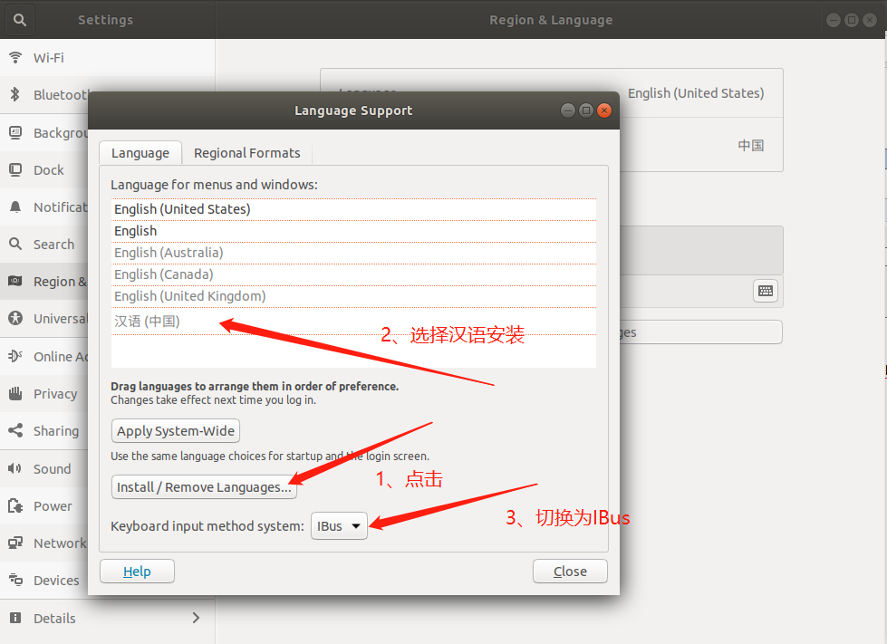
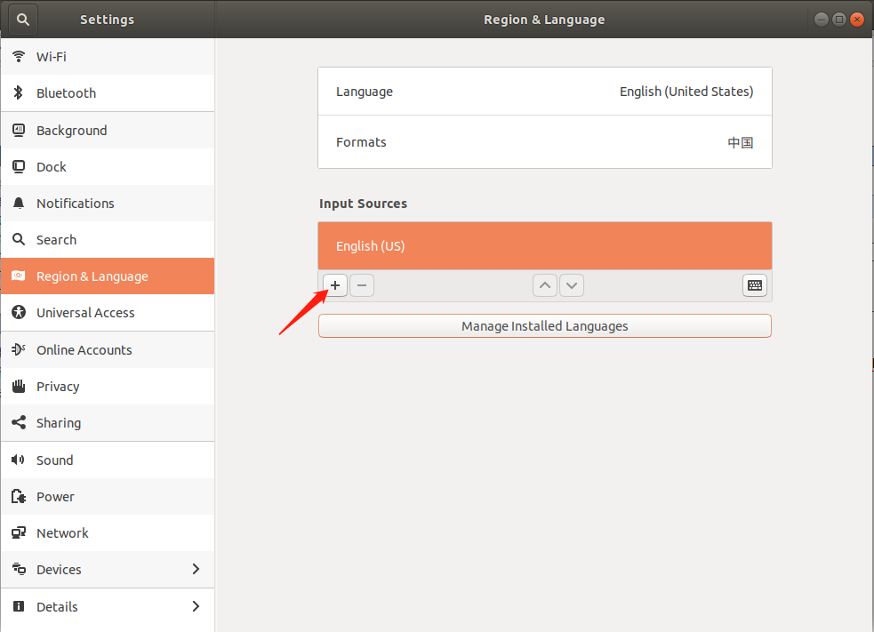
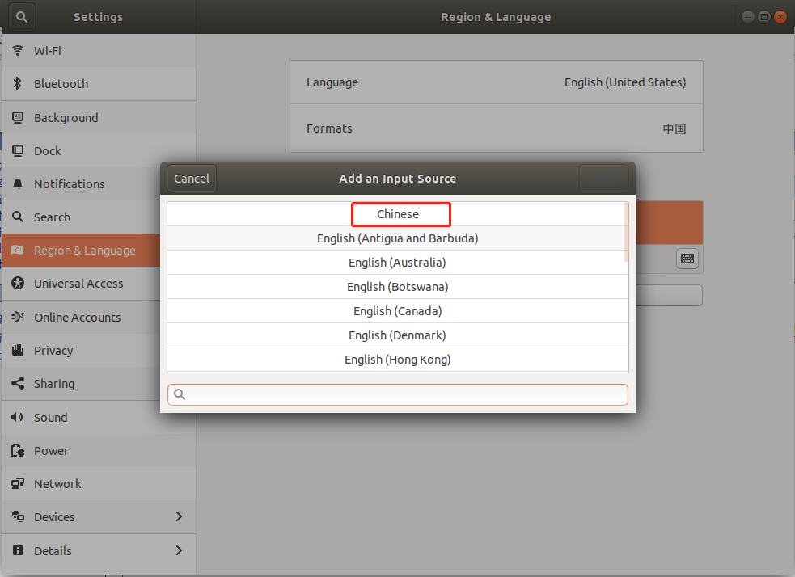
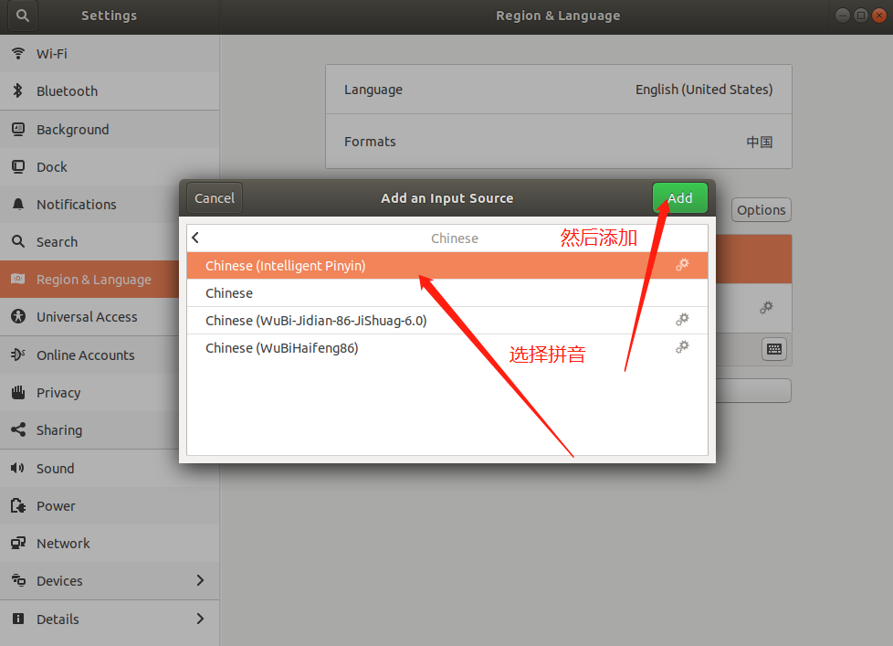
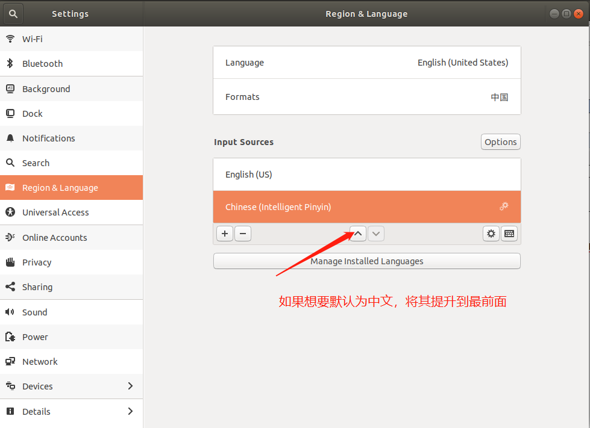

# 如何在ubuntu18.04中设置使用中文输入法

https://www.cnblogs.com/YMaster/p/8967233.html

ubuntu 在最新的版本中已经可以不用用户自己单独去下载中文输入法使用了，本次使用为 ubuntu18.04LTS版本(登陆是界面选择的是ubuntu on wayland)，设置方式非常简单

1. 打开设置，不知道的请点击右上角的工具栏即可看到。
   

2. 找到设置中语言项，点击语言安装管理，安装中文语言后选择输入方式。

   

   

   点击关闭，然后添加输入语言，在其中找到中文拼音添加即可

   

   

    
   

   可以看到中文输入法已经存在了，点击选择即可使用了，输入法看上去停像 sunpinyin，不管它了。如果要使用搜狗的话选择输入方式时请选择 XIM 方式。