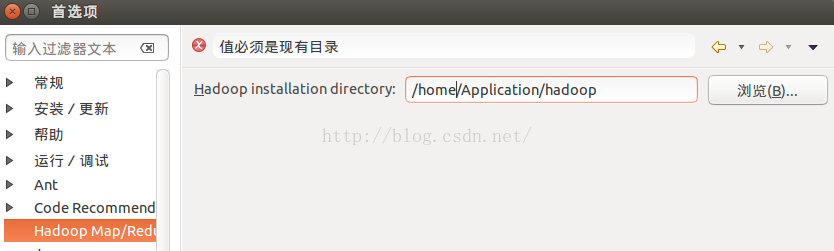

## 安装Hadoop-Eclipse-Plugin


​	https://blog.csdn.net/cuihaolong/article/details/51643505

1. 第一步：

   下载hadoop-eclipse-plugin，将release中最新的jar包复制到eclipse安装目录下的plugins文件夹中，重启eclipse。

   选择 Window 菜单下的 Preference ，然后弹出一个窗体，窗体的左侧会多出 Hadoop Map/Reduce 选项，点击此选项，选择 Hadoop 的安装目录（如/opt/hadoop）。

   


2. 第二步：

   切换 Map/Reduce 工作目录，选择 Window 菜单下选择 Perspective，打开透视图，其他，弹出一个窗体，从中选择 Map/Reduce 选项即可进行切换。

   


3. 第三步：

   点击Map/Reduce Location选项卡，点击右边小象图标，打开Hadoop Location配置窗口，输入Location Name，任意名称即可.配置Map/Reduce Master和DFS Mastrer，Host和Port配置成与core-site.xml和mapred-site.xml的设置一致即可。

   

 	点击"Finish"按钮，关闭窗口。

​	点击左侧的DFSLocations—>MapReduceProject（上一步配置的location name)，如能看到user，表示安装	成功。如果出现这个提示这个错误 

``` shell
Error:call from mylinux/127.0.1.1 to localhost:9090 failed on connection exception java.Connection.net.ConnectException拒绝连接。
```

​	首先确定 hadoop有没有启动，其他的原因参考其他作者的博客：在Ubuntu下使用Eclispe连接hadoop时拒绝链接解决方案总结

 

三、新建WordCount例子

​	File— > Project，选择Map/Reduce Project，输入项目名称WordCount等。

​	在WordCount项目里新建class，名称为`WordCount`，代码如下(可以参考/res/WordCount.java)：

``` java
/**
 * Licensed to the Apache Software Foundation (ASF) under one
 * or more contributor license agreements.  See the NOTICE file
 * distributed with this work for additional information
 * regarding copyright ownership.  The ASF licenses this file
 * to you under the Apache License, Version 2.0 (the
 * "License"); you may not use this file except in compliance
 * with the License.  You may obtain a copy of the License at
 *
 *     http://www.apache.org/licenses/LICENSE-2.0
 *
 * Unless required by applicable law or agreed to in writing, software
 * distributed under the License is distributed on an "AS IS" BASIS,
 * WITHOUT WARRANTIES OR CONDITIONS OF ANY KIND, either express or implied.
 * See the License for the specific language governing permissions and
 * limitations under the License.
 */
 
 
import java.io.IOException;
import java.util.StringTokenizer;
import org.apache.hadoop.conf.Configuration;
import org.apache.hadoop.fs.Path;
import org.apache.hadoop.io.IntWritable;
import org.apache.hadoop.io.Text;
import org.apache.hadoop.mapreduce.Job;
import org.apache.hadoop.mapreduce.Mapper;
import org.apache.hadoop.mapreduce.Reducer;
import org.apache.hadoop.mapreduce.lib.input.FileInputFormat;
import org.apache.hadoop.mapreduce.lib.output.FileOutputFormat;
import org.apache.hadoop.util.GenericOptionsParser;
 
public class WordCount {
  public static class TokenizerMapper 
       extends Mapper<Object, Text, Text, IntWritable>{
    private final static IntWritable one = new IntWritable(1);
    private Text word = new Text();
      
    public void map(Object key, Text value, Context context
                    ) throws IOException, InterruptedException {
      StringTokenizer itr = new StringTokenizer(value.toString());
      while (itr.hasMoreTokens()) {
        word.set(itr.nextToken());
        context.write(word, one);
      }
    }
  }
  
  public static class IntSumReducer 
       extends Reducer<Text,IntWritable,Text,IntWritable> {
    private IntWritable result = new IntWritable();
 
    public void reduce(Text key, Iterable<IntWritable> values, 
                       Context context
                       ) throws IOException, InterruptedException {
      int sum = 0;
      for (IntWritable val : values) {
        sum += val.get();
      }
      result.set(sum);
      context.write(key, result);
    }
  }
 
  public static void main(String[] args) throws Exception {
    Configuration conf = new Configuration();
    String[] otherArgs = new GenericOptionsParser(conf, args).getRemainingArgs();
    if (otherArgs.length < 2) {
      System.err.println("Usage: wordcount <in> [<in>...] <out>");
      System.exit(2);
    }
    Job job = Job.getInstance(conf, "word count");
//    job.setJarByClass(WordCount.class);
    job.setJar("/home/hyc/EclipseWS/hadoop/HadoopTest/bin/WordCount.class"); //根据自己的目录设置
    job.setMapperClass(TokenizerMapper.class);
    job.setCombinerClass(IntSumReducer.class);
    job.setReducerClass(IntSumReducer.class);
    job.setOutputKeyClass(Text.class);
    job.setOutputValueClass(IntWritable.class);
   
    
    for (int i = 0; i < otherArgs.length - 1; ++i) {
      FileInputFormat.addInputPath(job, new Path(otherArgs[i]));
    }
    FileOutputFormat.setOutputPath(job,
      new Path(otherArgs[otherArgs.length - 1]));
    System.exit(job.waitForCompletion(true) ? 0 : 1);
    job.waitForCompletion(true);
  }
}
```

* 在HDFS上创建目录input：

  ``` shell
  hadoop fs -mkdir input
  ```

​	这是使用命令来创建，我们可以在Eclipse里面右键hadoop(根据个人配置不同这个会有出入)进行创建。

* 拷贝本地任一文本文件到HDFS的input里：

  ``` shell
  hadoop fs -copyFromLocal /usr/local/hadoop/README.txt input
  ```

  同样我们可以右键input，然后选择Upload file  ，使用可视化的形式进行文件上传。

* 点击WordCount.java，右键，点击Run As—>Run Configurations，配置运行参数，参数为：

  ``` shell
  hdfs://localhost:9000/user/hyc/input hdfs://localhost:9000/user/hyc/output
  ```

  分别对应输入和输出，需要注意的是，每个人启动hadoop后的输入路径和输出路径均不相同，具体路径以eclipse右侧MapReduceProject中的文件夹路径为准。


  当然我们也可以在代码里直接写路径，真正搞懂文件系统你会发现方法还有很多，只是需要修改java代码。

   下面这个配置是对应了代码里面这个代码段：

  ``` shell
  String[] otherArgs = new GenericOptionsParser(conf, args).getRemainingArgs();
  ```

* 运行完成后，查看运行结果。

  第一种方法就是在终端里面直接使用命令行进行查看。

  ``` shell
  hadoop fs -ls output
  ```

  可以看到有两个输出结果，_SUCCESS和part-r-00000

  执行

  ``` shell
  hadoop fs -cat output/*
  ```

  第二种方法就是直接在Eclipse里面查看。

  首先记得刷新一下文件系统， 展开DFS Locations，双击打开part-r00000查看结果。 


* note

  1. 一般将log4j.properties，log4j-1.2.14.jar直接放在/opt/hadoop/etc/hadoop/下

     然后直接从这个位置导入，log4j.properties复制一份到项目下即可(详细见**第一、二个错误**)

  2. Windows**环境编译 hadoop-eclipse-plugins-2.8.5.jar 文件**

     https://blog.csdn.net/yunxiaoqinghe/article/details/83107933#14__hadoop2xeclipsepluginmasterzip_33


### 一些错误解决

1. 第一个错误：

   log4j警告:WARN Please initialize the log4j system properly 的解决方法
   https://blog.csdn.net/u010180815/article/details/52260170

   ``` shell
   log4j:WARN No appenders could be found for logger (org.springframework.context.support.
   
   ClassPathXmlApplicationContext).
   log4j:WARN Please initialize the log4j system properly.
   ```

   出现这个问题的原因则是因为没有为log4j建立配置文件导致的。所以解决问题的方法很简单，只要在 src文件目录下建立配置文件即可： 右键点击src-> New -> File

   

   文件的名称为  log4j.properties  , 文件中的内容设置为：

   ``` shell
   log4j.rootLogger=WARN, stdout
   log4j.appender.stdout=org.apache.log4j.ConsoleAppender
   log4j.appender.stdout.layout=org.apache.log4j.PatternLayout
   log4j.appender.stdout.layout.ConversionPattern=%d %p [%c] - %m%n
   ```

   然后测试运行，OK，问题解决！！

   附：

   Log4j是Apache的一个开源项目，通过使用Log4j，我们可以控制日志信息输送的目的地是控制台、文件、GUI组件，甚至是套接口服务器、NT的事件记录器、UNIX Syslog守护进程等；我们也可以控制每一条日志的输出格式；通过定义每一条日志信息的级别，我们能够更加细致地控制日志的生成过程。最令人感兴趣的就是，这些可以通过一个配置文件来灵活地进行配置，而不需要修改应用的代码。

   而spring就是使用log4j这个开源框架来输出信息。

2. 第二个错误：

   从<https://mvnrepository.com/artifact/log4j/log4j/1.2.14>下载

   log4j-1.2.14.jar

   复制到/opt/hadoop/etc/Hadoop

   最后在eclipse里配置jar包

   


​	导入下载的包

​	

3. 第三个错误：

   运行hadoop作业 

   ``` shell
   No job jar file set. User classes may not be found. See Job or
   ```

   明明在代码中设置了：

   ``` java
   job.setJarByClass(xxxxxxx.class);
   ```

   还是报错：`No job jar file set`.错误

   ``` shell
   WARN mapreduce.JobResourceUploader: No job jar file set.  User classes may not be found. See Job or Job#setJar(String).
   ```

   解决方案：

   在代码中使用：

   ``` java
   job.setJar("/home/hyc/EclipseWS/hadoop/HadoopTest/bin/WordCount.class");
   job.waitForCompletion(true);
   ```

   在编译打包提交作业就好了。

   或者使用`export HADOOP_CLASSPATH`

   例如：

   ``` shell
   export HADOOP_CLASSPATH=$HADOOP_CLASSPATH:$HADOOP_HOME/lib/native/*:/Users/chenxun/software/hadoop-2.8.1/myclass/*
   ```


