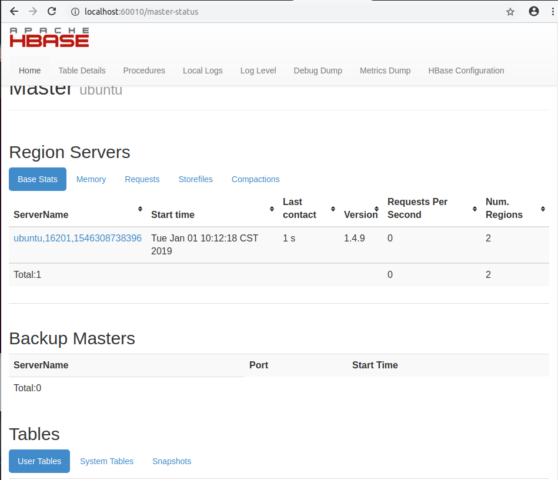

# 如何在ubuntu18.04中搭建HBase环境

安装版本HBase安装要求：

JDK1.7以上

Hadoop-2.5.0以上

Zookeeper-3.4.5

HBase

官方版本：http://archive.apache.org/dist/hbase/

CDH版本：http://archive.cloudera.com/cdh5/ （优点是稳定）


分布式Apache HBase安装依赖于正在运行的ZooKeeper集群。Apache HBase默认情况下为您管理ZooKeeper“集群”。它将启动和停止ZooKeeper集合作为HBase启动/停止过程的一部分。你还可以独立于HBase管理ZooKeeper集群，只需要在Hbase的配置文件hbase-env.sh中做一些设置即可。要切换ZooKeeper的HBase管理，请使用conf/hbase-env.sh中的HBASE_MANAGES_ZK变量。 此变量默认为true，告诉HBase是否启动/停止ZooKeeper集合服务器作为HBase启动/停止的一部分。如果为true，这Hbase把zookeeper启动，停止作为自身启动和停止的一部分。如果设置为false，则表示独立的Zookeeper管理。

Hbase为了简化集群部署，已经内置了zookeeper，大部分时候使用内置的zookeeper都可以非常方便的部署集群，而这一点与solr中solrcloud的集群部署非常相似，solrcloud也内置了zookeeper了，启动的时候可以由solr负责启动zookeeper，而在Hbase中，则是由Hbase负责启动zookeeper的。 

其实，大多数的分布式应用框架，都离不开zookeeper这个统一协作服务，当然，我们也可以不用其内置的 zookeeper，由我们自己来安装维护独立的zookeeper集群，关于外置和内置的zookeeper也算各有利弊。 


***

#### HBase安装：

1. 键入如下命令将HBase软件包解压至指定目录：

   ``` shell
   tar -zxvf hbase-1.2.6-bin.tar.gz -C /opt
   mv /opt/hbase-1.2.6 /opt/hbase
   ```

   键入如下命令，切换至HBase配置文件所在路径：

   ``` shelll
   cd /opt/hbase/conf
   ```


2. 编辑`hbase-env.sh`HBase环境变量配置文件

   ``` shell
   gedit conf/hbase-env.sh
   ```

   填入如下内容：

   ``` shell
   export JAVA_HOME=/opt/java/jdk1.8
   # Tell HBase whether it should manage it's own instance of Zookeeper or not.
   export HBASE_MANAGES_ZK=true #配置hbase自己管理zookeeper
   ```

   Hbase为了简化集群部署，已经内置了zookeeper，大部分时候使用内置的zookeeper都可以非常方便的部署集群，而这一点与solr中solrcloud的集群部署非常相似，solrcloud也内置了zookeeper了，启动的时候可以由solr负责启动zookeeper，而在Hbase中，则是由Hbase负责启动zookeeper的。 


3. 编辑`hbase-site.xml`配置文件

   ``` shell
   gedit conf/hbase-env.sh
   ```

   填写内容如下：

   ``` xml
   <configuration>	
   	<!-- 配置temp目录 -->
   	<property>
   		<name>hbase.tmp.dir</name>
   		<value>/opt/hbase/data/tmp</value>
   	</property>
   
   	<!-- zookeeper集群地址,有多个用","隔开 -->
   	<property>
   		<name>hbase.zookeeper.quorum</name>
   		<value>localhost</value>
   	</property>
   
   	<!-- zookeeper数据目录 -->
   	<property>
   		<name>hbase.zookeeper.property.dataDir</name>
   		<value>/opt/hadoop/zookeeper</value>
   	</property>
   
   	<!-- 开启集群分布式模式 -->
   	<property>
   		<name>hbase.cluster.distributed</name>
   		<value>true</value>
   	</property>
   
   	<!-- HBase 数据存放到 hdfs上 -->
   	<property>
   		<name>hbase.rootdir</name>
   		<value>hdfs://localhost:9000/hbase</value>
   	</property>
   
   	<!-- hbase WEB UI 端口配置 -->
   	<property>
   		<name>hbase.master.info.port</name>
   		<value>60010</value>
   	</property>
   </configuration>
   ```


4. 启动HBase(需要先启动dfs)

   ``` shell
   /opt/hbase/bin/start-hbase.sh
   ```

   ``` shell
   hyc@ubuntu:/opt/hbase$ jps
   7521 HQuorumPeer
   4369 NameNode
   4610 DataNode
   5557 HRegionServer
   9546 Jps
   8779 HMaster
   4878 SecondaryNameNode
   ```

   正常情况下可以看见：HQuorumPeer、HRegionServer、HMaster三个进程

   可直接命令配置到环境变量中

   ``` shell
   # 配置环境变量
   sudo gedit /etc/environment
   ```

   ``` shell
   export HBASE_HOME=/opt/hbase
   PATH="$PATH:$HBASE_HOME/bin"
   ```

   ``` shell
   # 配置所有用户的环境变量
   sudo gedit /etc/profile
   ```

   ``` shell
   export HBASE_HOME=/opt/hbase
   export PATH=$HBASE_HOME/bin:$PATH
   ```

   使之生效

   ``` shell
   source /etc/environment
   source /etc/profile
   ```


5. 检查HBase，是否成功安装：
    检查hdfs上是否有/hbase目录

   ``` shelll
   hyc@ubuntu:/opt/hbase$ hadoop fs -ls /hbase
   Found 8 items
   drwxr-xr-x   - hyc supergroup          0 2019-01-01 10:33 /hbase/.tmp
   drwxr-xr-x   - hyc supergroup          0 2019-01-01 10:33 /hbase/MasterProcWALs
   drwxr-xr-x   - hyc supergroup          0 2019-01-01 10:33 /hbase/WALs
   drwxr-xr-x   - hyc supergroup          0 2019-01-01 10:33 /hbase/data
   drwxr-xr-x   - hyc supergroup          0 2019-01-01 10:33 /hbase/hbase
   -rw-r--r--   1 hyc supergroup         42 2019-01-01 10:33 /hbase/hbase.id
   -rw-r--r--   1 hyc supergroup          7 2019-01-01 10:33 /hbase/hbase.version
   drwxr-xr-x   - hyc supergroup          0 2019-01-01 10:33 /hbase/oldWALs
   ```


6. 访问http://localhost:60010，可以看到如下画面

   


7. 至此，Hbase的伪分布式集群基本搭建完毕~

***

### HBase基本使用

|          名称          |                          命令表达式                          |
| :--------------------: | :----------------------------------------------------------: |
|         创建表         |        create '表名称', '列名称1','列名称2','列名称N'        |
|        添加记录        |           put '表名称', '行名称', '列名称:', '值'            |
|        查看记录        |                    get '表名称', '行名称'                    |
|   查看表中的记录总数   |                       count  '表名称'                        |
|        删除记录        |             delete  '表名' ,'行名称' , '列名称'              |
|       删除一张表       | 先屏蔽表，才能对表进行删除，第一步 disable '表名称' 第二步  drop '表名称' |
|      查看所有记录      |                        scan "表名称"                         |
| 查看某表某列中所有数据 |                 scan "表名称" , ['列名称:']                  |
|        更新记录        |                     就是重写一遍进行覆盖                     |


1. 基本使用

   ``` shell
   hyc@ubuntu:/opt/hbase$ hbase shell
   hbase(main):002:0> create 'test','info' # 创建test表
   hbase(main):003:0> list 'test' # 查看表
   => ["test"]
   hbase(main):004:0> exists 'test'
   
   # test指表名，0001指行键名，info:username指列名，henry指单元格值。ts1指时间戳，一般省略
   hbase(main):009:0> put 'test','0001','info:username','henry' # 给表赋值
   hbase(main):011:0> put 'test','0001','info:userage','20'
   
   # 也可以指定一些修饰词：TIMERANGE, FILTER, LIMIT, STARTROW, STOPROW, TIMESTAMP, MAXLENGTH,or COLUMNS。没任何修饰词，就是下边例句，就会显示所有数据行。
   hbase(main):012:0> scan 'test' # 扫描所有数据 
   
   hbase(main):013:0> describe 'test'
   hbase(main):014:0> disable 'test' # 更改表之前需要将表的状态更改为disable
   hbase(main):015:0> is_enabled 'test'
   hbase(main):016:0> drop 'test' # 删除test表
   ```

2. HBase表数据操作命令

   ``` shell
   hbase(main):018:0> create 'test','info'
   hbase(main):019:0> put 'test','0001','info:username','henry'
   hbase(main):020:0> put 'test','0001','info:userage','20'
   hbase(main):021:0> count 'test' # 统计行数
   hbase(main):022:0> get 'test','0001','info:username' # 查询列表中某行或某列
   hbase(main):023:0> delete 'test','0001','info:age'
   hbase(main):024:0> scan 'test'
   # 可以看出，hbase是先将掉disable掉，然后drop掉后重建表来实现truncate的功能的
   hbase(main):025:0> truncate 'test' # 清空表的所有数据
   Truncating 'test' table (it may take a while):
    - Disabling table...
    - Truncating table...
   0 row(s) in 3.9260 seconds
   ```


***


Hbase是建立Hadoop基础上的数据库文件，因此Hbase是分布式的数据库。Hbase也提供了单机版的安装。

Hadoop和Hbase版本关系表：​	

| 版本               | HBase-0.94.x | HBase-0.98.x | HBase-1.0.x | HBase-1.1.x | HBase-1.2.x |
| ------------------ | ------------ | ------------ | ----------- | ----------- | ----------- |
| Hadoop-1.0.x       | X            | X            | X           | X           | X           |
| Hadoop-1.1.x       | S            | NT           | X           | X           | X           |
| Hadoop-0.23.x      | S            | X            | X           | X           | X           |
| Hadoop-2.0.x-alpha | NT           | X            | X           | X           | X           |
| Hadoop-2.1.0-beta  | NT           | X            | X           | X           | X           |
| Hadoop-2.2.0       | NT           | S            | NT          | NT          | X           |
| Hadoop-2.3.x       | NT           | S            | NT          | NT          | X           |
| Hadoop-2.4.x       | NT           | S            | S           | S           | S           |
| Hadoop-2.5.x       | NT           | S            | S           | S           | S           |
| Hadoop-2.6.0       | X            | X            | X           | X           | X           |
| Hadoop-2.6.1+      | NT           | NT           | NT          | NT          | S           |
| Hadoop-2.7.0       | X            | X            | X           | X           | X           |
| Hadoop-2.7.1+      | NT           | NT           | NT          | NT          | S           |

 

Hadoop和JDK版本关系表：

| Hbase版本 | JDK 6         | JDK 7 | JDK 8         |
| --------- | ------------- | ----- | ------------- |
| 1.2       | Not Supported | yes   | yes           |
| 1.1       | Not Supported | yes   | Not Supported |
| 1         | Not Supported | yes   | Not Supported |
| 0.98      | yes           | yes   | Not Supported |
| 0.94      | yes           | yes   | N/A           |


\-  S = supported and tested,支持

\-  X = not supported,不支持

\-  NT = not tested enough.可以运行但测试不充分