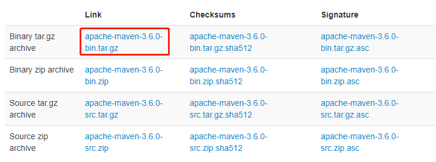
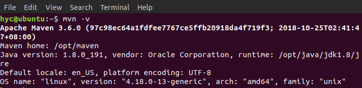
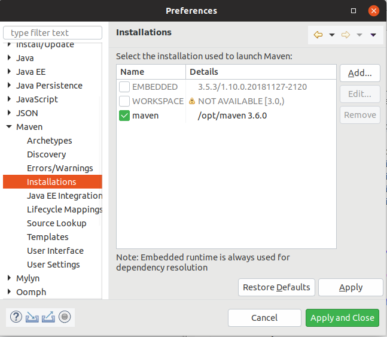
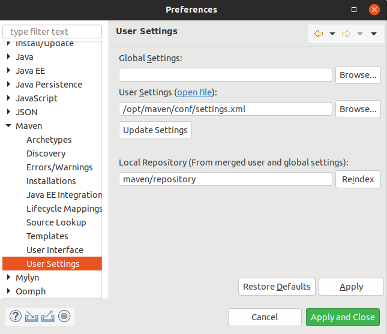
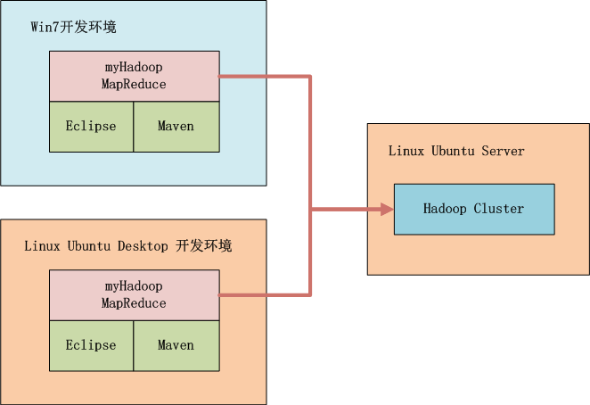
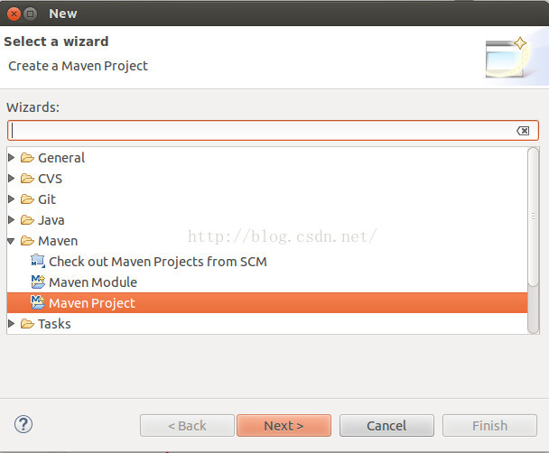

# 用Maven构建Hadoop项目


***

http://blog.fens.me/hadoop-maven-eclipse/

Hadoop的MapReduce环境是一个复杂的编程环境，所以我们要尽可能地简化构建MapReduce项目的过程。Maven是一个很不错的自动化项目构建工具，通过Maven来帮助我们从复杂的环境配置中解脱出来，从而标准化开发过程。所以，写MapReduce之前，让我们先花点时间把刀磨快！


[TOC]

## Maven介绍

Apache Maven，是一个**Java的项目管理及自动构建工具**，由Apache软件基金会所提供。基于项目对象模型（缩写：POM）概念，Maven利用一个中央信息片断能管理一个项目的构建、报告和文档等步骤。曾是Jakarta项目的子项目，现为独立Apache项目。

maven的开发者在他们开发网站上指出，maven的目标是要使得项目的构建更加容易，它把编译、打包、测试、发布等开发过程中的不同环节有机的串联了起来，并产生一致的、高质量的项目信息，使得项目成员能够及时地得到反馈。maven有效地支持了测试优先、持续集成，体现了鼓励沟通，及时反馈的软件开发理念。如果说Ant的复用是建立在”拷贝–粘贴”的基础上的，那么Maven通过插件的机制实现了项目构建逻辑的真正复用。

https://blog.csdn.net/u012152619/article/details/51473380

Maven的正确发音是[ˈmevən]，而不是“马瘟”以及其他什么瘟。Maven在美国是一个口语化的词语，代表专家、内行的意思，约等于北京话中的老炮儿。

一个对Maven比较正式的定义是这么说的：Maven是一个项目管理工具，它包含了一个项目对象模型 (POM：Project Object Model)，一组标准集合，一个项目生命周期(Project Lifecycle)，一个依赖管理系统(Dependency Management System)，和用来运行定义在生命周期阶段(phase)中插件(plugin)目标(goal)的逻辑。

Maven到底是什么，能做什么，可以用更通俗的方式来说明。我们知道，项目开发不仅仅是写写代码而已，期间会伴随着各种必不可少的事情要做，下面列举几个感受一下：

> 我们需要引用各种jar包，尤其是比较大的工程，引用的jar包往往有几十个乃至上百个， 每用到一种jar包，都需要手动引入工程目录，而且经常遇到各种让人抓狂的jar包冲突，版本冲突。
>
> 我们辛辛苦苦写好了Java文件，可是只懂0和1的白痴电脑却完全读不懂，需要将它编译成二进制字节码。好歹现在这项工作可以由各种集成开发工具帮我们完成，Eclipse、IDEA等都可以将代码即时编译。当然，如果你嫌生命漫长，何不铺张，也可以用记事本来敲代码，然后用javac命令一个个地去编译，逗电脑玩。
>
> 世界上没有不存在bug的代码，正如世界上没有不喜欢美女的男人一样。写完了代码，我们还要写一些单元测试，然后一个个的运行来检验代码质量。
>
> 再优雅的代码也是要出来卖的。我们后面还需要把代码与各种配置文件、资源整合到一起，定型打包，如果是web项目，还需要将之发布到服务器，供人蹂躏。

试想，如果现在有一种工具，可以把你从上面的繁琐工作中解放出来，能帮你构建工程，管理jar包，编译代码，还能帮你自动运行单元测试，打包，生成报表，甚至能帮你部署项目，生成Web站点，你会心动吗？傻子才不会。

负责任的告诉你，以上的一切Maven都可以办到。概括地说，Maven可以简化和标准化项目建设过程。处理编译，分配，文档，团队协作和其他任务的无缝连接。


用途、核心概念
--------------------- 

http://www.trinea.cn/android/maven/

由浅入深，主要介绍**maven的用途、核心概念**(Pom、Repositories、Artifact、Build Lifecycle、Goal)、**用法**（Archetype意义及创建各种项目）、**maven常用参数和命令以及简单故障排除、maven扩展**（eclipse、cobertura、findbugs、插件开发）、**maven配置**。

**1、maven的用途**

> maven是一个项目构建和管理的工具，提供了帮助管理 构建、文档、报告、依赖、scms、发布、分发的方法。可以方便的编译代码、进行依赖管理、管理二进制库等等。
> maven的好处在于可以将项目过程规范化、自动化、高效化以及强大的可扩展性
> 利用maven自身及其插件还可以获得代码检查报告、单元测试覆盖率、实现持续集成等等。


## Maven安装(ubuntu)

第一步，下载Maven：<http://maven.apache.org/download.cgi>



第二步，解压到/opt/maven目录

``` shell
tar -xzvf apache-maven-3.6.0-bin.tar.gz
mv apache-maven-3.6.0-bin/ /opt/maven
```

第三步，配置mavne环境

``` shell
sudo gedit /etc/profile
```

在文件内容后面添加以下内容：

``` shell
export M2_HOME=/opt/maven
export CLASSPATH=$CLASSPATH:$M2_HOME/lib
export PATH=$PATH:$M2_HOME/bin
```

保存，输入以下命令使配置文件生效

``` shell
source /etc/profile
```

验证是否安装成功 **mvn -v**，出现以下结果，代表安装成功



第四步，修改maven源为[阿里云](https://www.baidu.com/s?wd=%E9%98%BF%E9%87%8C%E4%BA%91&tn=24004469_oem_dg&rsv_dl=gh_pl_sl_csd)，以及仓库默认存放路径。这样maven下载jar包的速度会快很多。

打开maven的配置文件

``` shell
sudo gedit /opt/maven/conf/settings.xml
```

１．在/home目录下生成maven/repository文件夹。

```xml
<localRepository>maven/repository</localRepository>
```

２．修改源

``` xml
<mirrors>
	<mirror>
		<id>nexus-aliyun</id>
		<mirrorOf>central</mirrorOf>
		<name>Nexus aliyun</name>
		<url>http://maven.aliyun.com/nexus/content/groups/public</url>
	</mirror>
  </mirrors>
```

第五步，安装eclipse的maven插件

help--install new software--add
官网地址:https://www.eclipse.org/m2e/
Name:m2e
Location:http://download.eclipse.org/technology/m2e/releases

然后配置Maven的安装位置



点击 Browse 按钮，选到你 maven 的 setting.xml 配置文件，然后点击 OK，这样就完成了 eclipse maven 插件的配置



第六步，至此，Eclipse下Maven、SVN环境已经配置完成


## Maven搭建测试Hadoop开发



新建一个Maven项目



catolog我选择的是默认的quickstart


* 关于groupId，可以看做是个包吧，左右图对照便可以看到在src/main/java和src/test/java里边都出现了yjj包。
* 关于artifactId，可以看做是工程名，也会在yjj包里边生成一个同名的包。
* 版本号默认即可，packaging则定义了打包后的jar名，这里应该会生成一个jar.jar包吧

Maven项目有如下通用约定，

- src/main/java用于存放源代码
- src/test/java用于存放单元测试代码
- target则用于存放编译生成的class以及打包后生成的输出文件


在pom.xml里边添加Hadoop的依赖项

``` xml
<project xmlns="http://maven.apache.org/POM/4.0.0"
         xmlns:xsi="http://www.w3.org/2001/XMLSchema-instance"
         xsi:schemaLocation="http://maven.apache.org/POM/4.0.0
                             http://maven.apache.org/xsd/maven-4.0.0.xsd">
    <modelVersion>4.0.0</modelVersion>
    <groupId>TestGroupId</groupId>
    <artifactId>TestArtifactId</artifactId>
    <version>0.0.1-SNAPSHOT</version>
    <packaging>jar</packaging>
    <name>TestArtifactId</name>
    <url>http://maven.apache.org</url>

    <properties>
    	<project.build.sourceEncoding>UTF-8</project.build.sourceEncoding>
    </properties>

    <dependencies>
        <dependency>
            <groupId>junit</groupId>
            <artifactId>junit</artifactId>
            <version>3.8.1</version>
            <scope>test</scope>
        </dependency>

        <dependency>
            <groupId>org.apache.hadoop</groupId>
            <artifactId>hadoop-common</artifactId>
            <version>2.8.5</version>
        </dependency>
        
        <dependency>
            <groupId>org.apache.hadoop</groupId>
            <artifactId>hadoop-hdfs</artifactId>
            <version>2.8.5</version>
        </dependency>
        
        <dependency>
            <groupId>org.apache.hadoop</groupId>
            <artifactId>hadoop-mapreduce-client-core</artifactId>
            <version>2.8.5</version>
        </dependency>
        
        <dependency>
            <groupId>org.apache.hadoop</groupId>
            <artifactId>hadoop-mapreduce-client-jobclient</artifactId>
            <version>2.8.5</version>
        </dependency>
        
        <dependency>
            <groupId>org.apache.hadoop</groupId>
            <artifactId>hadoop-mapreduce-client-common</artifactId>
            <version>2.8.5</version>
        </dependency>
    </dependencies>
</project>
```


